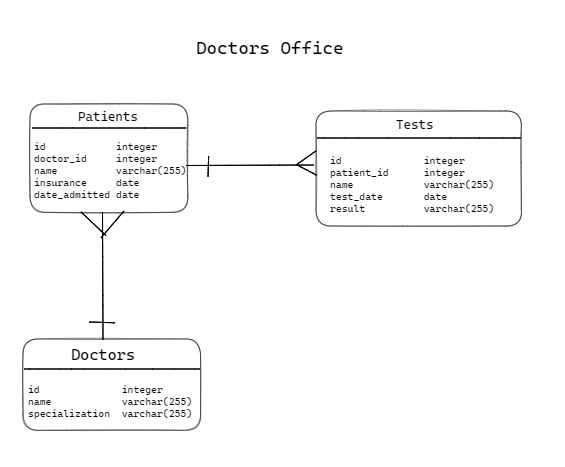

# Week 3 Assessment

  

For the following set of questions, refer to the Doctors Office ERD above.
1. How many patients can each doctor have?
1. How many doctors can each patient have?
1. How would you describe the relationship between patients and tests? Be sure to use either one-to-one, one-to-many, or many-to-many in your answer.
1. What are the foreign keys in this diagram?
1. What is the primary key for the Tests table.
